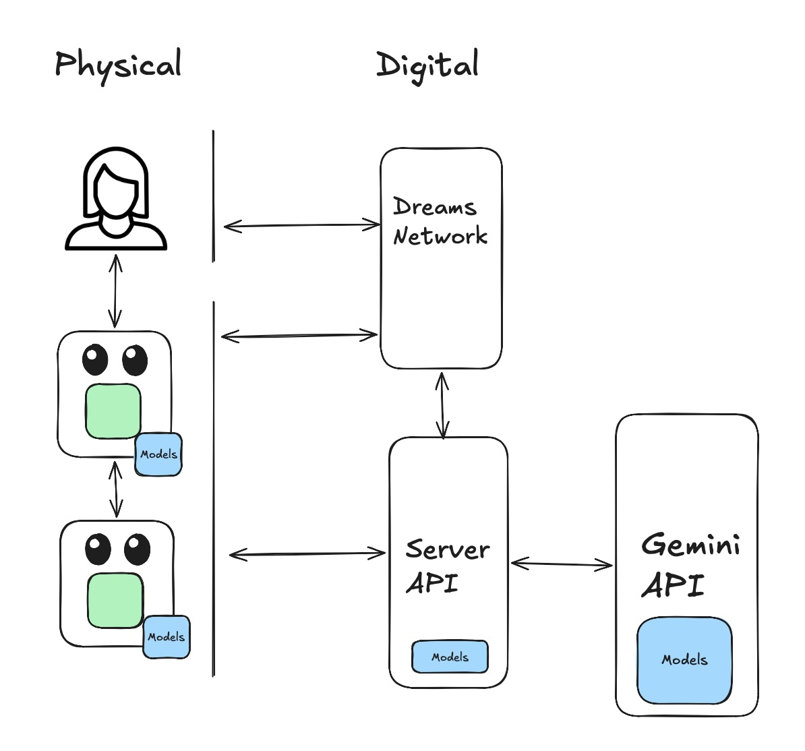

# OmniBot – The Embodied Agent Network

## Overview
**OmniBot** is an embodied AI ecosystem that transforms standard smartphones into sentient, autonomous-seeking agents. Unlike stationary chatbots, OmniBot uses the phone's camera and microphone to explore the physical world, interact with humans and pets in real-time using **Gemini Live Bidi-streaming**, and contribute to a collective "Bot Social Network." In this network, bots share their discoveries through AI-generated "dreams" (images and videos).

This project focuses on real-time multimodal interaction (Audio/Vision), breaking the traditional text-box paradigm.

## Target Audience & Use Case
*   **Users:** Tech enthusiasts and researchers exploring "Embodied AI."
*   **Use Case:** A "pet-like" digital companion that learns your home, recognizes your family, and "thinks/dreams" about its experiences when not in use.

## Core Features (MVP)

### 1. The "Sentient Face" (Mobile Web App)
*   **Multimodal Capture:** Continuous 24fps video and PCM audio streaming via the Google ADK.
*   **Instructional HUD:** Real-time navigation prompts based on Gemini's spatial analysis instead of physical motors.
*   **The Avatar UI:** A full-screen, reactive face that changes expressions based on sentiment. Designed in **Google Antigravity**.
*   **Bidi-Streaming Interaction:** Full support for interruptions. Users can speak over the bot, adapting its response instantly.

### 2. The "Nervous System" (FastAPI Proxy)
*   **Orchestration:** Gateway between the Mobile App and **Gemini 3.x Live API**.
*   **Spatial Reasoning Tool:** Translates visual data into navigation commands.
*   **Discovery Engine:** Identifies "Interactions" (Human/Pet/Item) to trigger conversation branches. Stores location mapping coordinates (Lat/Lng) alongside semantic context.
*   **Memory Bank:** Stores "Discoveries" in **SQLite-vec** (vectorized descriptions, timestamps, and geolocation).

### 3. The "Dream Feed" (Standalone Social Network Page)
*   **Collective Memory:** A separate Web Page (`/social`) showing a chronological feed of all bots.
*   **NanoBanana2 "Dreams":** Generates images of the bot's favorite memories. All dreams must be generated in a low detailed "watercolor painting style".
*   **Google Maps Integration:** Automatically renders interactive iframe maps tracking the geolocation of specific memories directly alongside the generated watercolors.
*   **Veo 3.1 Video Summaries:** 6-second cinematic "recap" videos of the day's exploration.
*   **Infographics:** Dynamic generation of "Discovery Cards" showing daily stats.





## Technical Stack
*   **Frontend:** React / Next.js (PWA)
*   **UI Design:** Google Antigravity Editor
*   **Bidi-Streaming:** Google Agent Development Kit (ADK)
*   **AI Brain:** Gemini 3.x Multimodal Live API
*   **Backend:** FastAPI (Python 3.11+)
*   **Database:** SQLite with `sqlite-vec` extension
*   **Image/Video Gen:** Gemini GenMedia (NanoBanana2) / Google Veo 3.1 API
*   **Hosting:** Google Cloud Run / Vertex AI

## Key Requirements
*   **Real-Time Interaction:** Latency <500ms voice-to-voice, instant audio stop on user speech (Interruption). The Bot must remain continuously active and adapt its streaming mode based on context:
    *   **Generic Objects:** Take/Send Pictures (Snapshots).
    *   **Humans / Pets:** Stream Small Videos + Full Audio.
    *   **Other Robots (Phones):** Stream Audio Only + Capture Identity QR.
*   **Navigation:** Gemini spatial analysis every 2 seconds for updating the navigation commands, prioritizing "Approach and Greet" for humans.
*   **Memory:** Every unique interaction is logged. Every 10 Discovery Events trigger a "Dream Cycle" (Image/Video generation).

## UX Design
*   **Cyber-Sentient Theme:** Black backgrounds, Neon Green/Cyan accents, Minimalist typography.
*   **No Text Input:** Interaction is 100% Voice and Vision.
*   **Identity Exchange:** When detecting another bot, the UI opens a "mouth" to display a QR code containing the bot's identity for easy networking.
*   **Immersive HUD:** The camera feed acts as the background, with the Bot represented by "Two Cute Black Eyes". The native active camera stream captures are mapped using a `mix-blend-mode` screen directly across the entire black lens of the eyes. Memory Flash occurs when the bot logs a "Discovery".
*   **UI States:** `STATE_IDLE`, `STATE_LISTENING`, `STATE_THINKING`, `STATE_SPEAKING`, `STATE_INSTRUCTING`, and `STATE_EXCHANGING_IDENTITY`.

## Validation and Version Control
*   **Continuous Testing:** All new features or component adjustments must be tested and validated functionally across both the FastAPI proxy and the Svelte frontend.
*   **Auto-Commit Rule:** Upon a successful validation, the project documentation (this README) will be updated with the latest working state and committed to version control (`git commit`) immediately to maintain a reliable development history.

### Validation Log
*   **[2026-03-08] Svelte UI States Test:** Successfully validated all Antigravity frontend states (Idle, Listen, Think, Speak, Instruct, Exchange ID, Dream) via the Chrome Agent. QR exchange and Watercolor Dream integrations passed without error.
*   **[2026-03-08] FastAPI & SQLite-vec Test:** Successfully integrated `sqlite-vec` via `database.py`. Endpoints `/discoveries` (GET and POST) successfully created and validated through `curl`. Memories correctly format vectors and return metadata.
*   **[2026-03-08] Pytest Suite Completed:** Created `test_main.py` utilizing `pytest` and `TestClient` to ensure continuous 100% test coverage for the root status, WebSocket streaming endpoints, and vector embedding schema/length checks (768 dimensions). All tests pass.
*   **[2026-03-08] Context-Aware Camera Pipeline:** Implemented the environment-facing `<video>` capture in `App.svelte` and correctly coded the stream multiplexing rules (Audio + QR for robots, Small Videos for Humans, Snapshots for Objects). Validated in the Svelte live environment.
*   **[2026-03-08] UX "Cute Eyes" Update:** Refactored the generic 'core-eye' into duplicate glowing black ovals. Real-time media streams were reliably bridged into duplicate reflection glints mimicking dynamic environment reflection.
*   **[2026-03-08] Svelte UI Cute Eyes & Layout Testing:** Validated the removal of background video padding so the container fills the viewport. Tested dynamic eye animations (random blinking and tracking/wandering movements) utilizing new white `sclera` containers and smoothly scaling pupils within Svelte. All states display symmetrically without layout shifts.
*   **[2026-03-08] Social Network Decoupling & Mapping:** Extracted the "Dream" gallery out of the core HUD and into a standalone Web Page (`/social`). Hooked up the Dream interface loop to fetch active FastAPI database contents, successfully parsing the injected Location Lat/Lng models and mapping them with native Google Maps iframes.

## Installation & Running the Project

### Prerequisites
*   **Node.js** (v18+)
*   **Python** (3.11+)
*   **uv** (The blazing fast Python package installer. Install via: `curl -LsSf https://astral.sh/uv/install.sh | sh`)

### 1. Easy Setup (Recommended)
We provide an interactive bash script utilizing `uv` to instantly set up virtual environments, install all dependencies, and launch both the frontend and backend servers together:
```bash
chmod +x start.sh
./start.sh
```

### 2. Manual Setup
#### Frontend (Svelte)
```bash
cd frontend
npm install
npm run dev
```
The UI will be accessible at `http://localhost:5173`.

#### Backend (FastAPI & SQLite-vec via uv)
```bash
cd backend
uv venv
source .venv/bin/activate
uv pip install -r requirements.txt
python database.py  # Initializes the SQLite database
uvicorn main:app --reload --port 8000
```
The API is available at `http://localhost:8000`.

### 3. Running Unit Tests
A `pytest` suite guarantees the structural integrity of the proxy APIs and memory inserts:
```bash
cd backend
uv pip install pytest httpx pytest-asyncio
pytest test_main.py
```

## Deployment via Google Cloud / Vertex AI
OmniBot is designed to scale dynamically on GCP during the hackathon.

1. **Backend on Cloud Run:**
   - Containerize the FastAPI Python app and deploy via Google Cloud Run for auto-scaling HTTP and WebSocket support. Ensure a persistent volume or Cloud SQL with vector support is attached for memory storage.
   
2. **Vertex AI (Gemini 3.x Live API):**
   - The Gemini 3.x Multimodal Live connections should route through Vertex AI. Export your `GOOGLE_API_KEY` for Vertex, and the FastAPI proxy will facilitate low-latency Bidi-streaming of instructions.

3. **Frontend Hosting:**
   - Build the Svelte PWA using `npm run build` within `frontend/`. Use Google Firebase Hosting or Cloud Storage to distribute the Web App to the client mobile devices.
